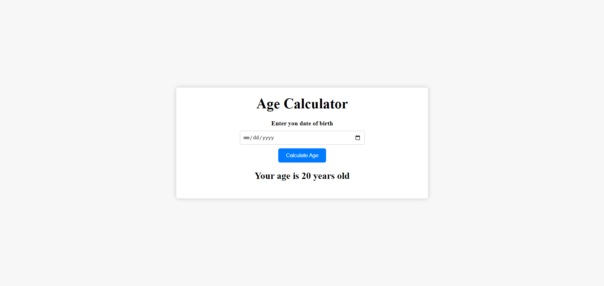

# Age Calculator

This project is a handy tool for determining a person's age from their date of birth.

## Installation

1. **Clone the repository:**
```bash
  git clone https://github.com/alecodify/html-css-javascript-projects.git
```

## Demo
[Watch the demo video](https://github.com/user-attachments/assets/7c50f40a-a7f5-499e-9fd5-d12c43ba95a2)

## Screenshots

<div style="display: flex; flex-direction: 'row';">


</div>

## Contributing
Contributions are welcome! Please feel free to submit a Pull Request.