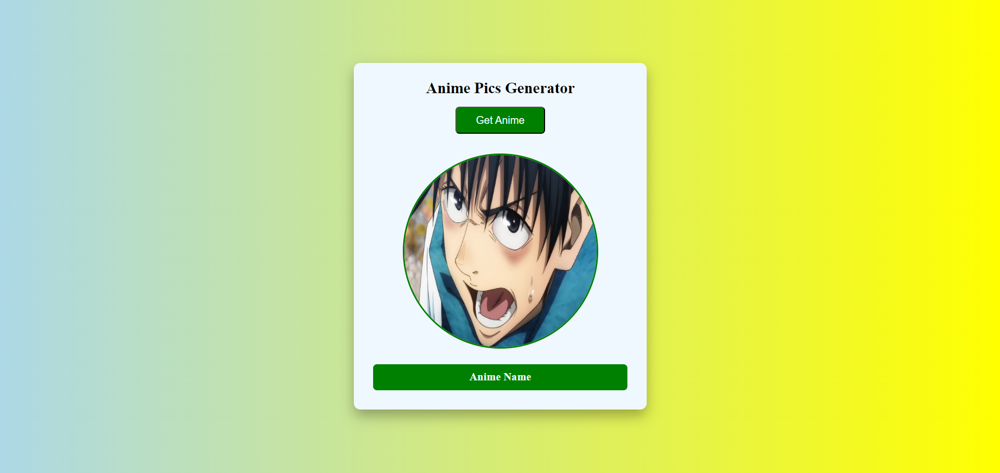

# Anime Pic Generator

The project allows users to fetch and display anime picture. 

## Installation

1. **Clone the repository:**
```bash
  git clone https://github.com/alecodify/html-css-javascript-projects.git
```

## Demo
[Watch the demo video](https://github.com/user-attachments/assets/670d084f-c206-4784-8afb-a6aee2dfde11)

## Screenshots

<div style="display: flex; flex-direction: 'row';">


</div>

## Contributing
Contributions are welcome! Please feel free to submit a Pull Request.