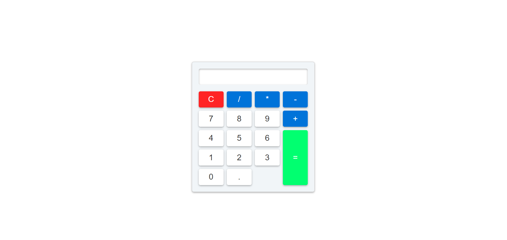
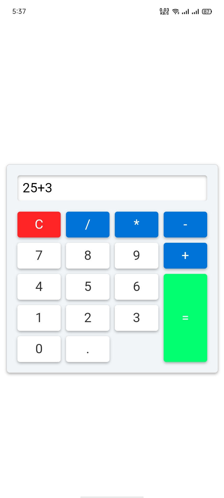

# Basic Calculator

This project is a simple web-based calculator that performs basic arithmetic operations such as addition, subtraction, multiplication, and division. 

## Installation

1. **Clone the repository:**
```bash
  git clone https://github.com/alecodify/html-css-javascript-projects.git
```

## Demo
[Watch the demo video](https://github.com/user-attachments/assets/743f15a5-ad62-4a9a-add7-94bc85bca1d8)

## Screenshots

<div style="display: flex; flex-direction: 'row';">



</div>

## Contributing
Contributions are welcome! Please feel free to submit a Pull Request.