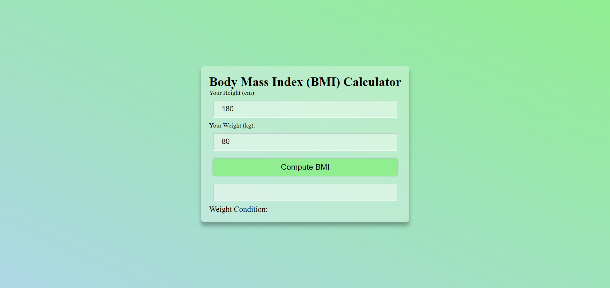
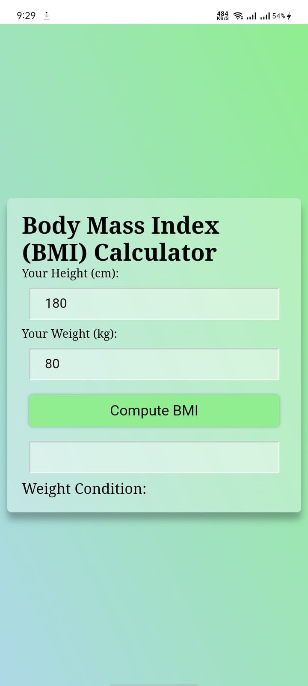
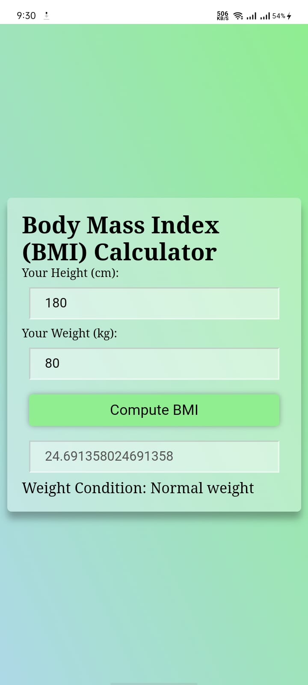

# BMI Calculator

This project is a simple web application that allows users to calculate their Body Mass Index (BMI) based on their height and weight.

## Installation

1. **Clone the repository:**
```bash
  git clone https://github.com/alecodify/html-css-javascript-projects.git
```

## Demo
[Watch the demo video](https://github.com/user-attachments/assets/bb8f804d-d53c-4373-8548-8c6d62a186bd)

## Screenshots

<div style="display: flex; flex-direction: 'row';">


</div>

## Contributing
Contributions are welcome! Please feel free to submit a Pull Request.