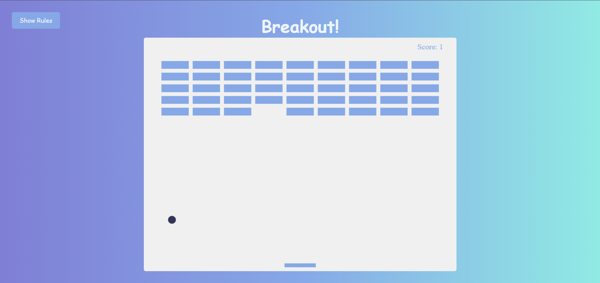
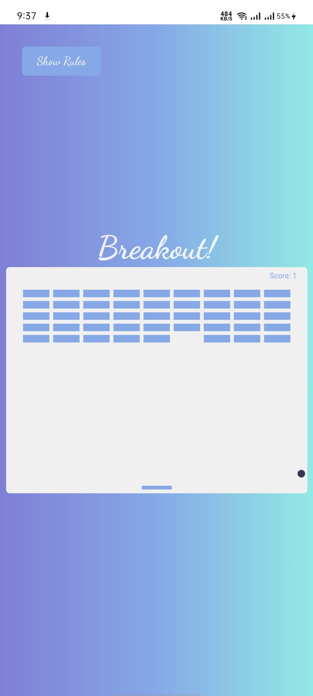
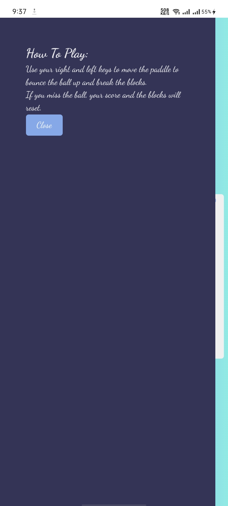

# Breakout Game

This project is a classic arcade game. The objective of the game is to control a paddle to hit a ball and break all the bricks on the screen without letting the ball fall past the paddle.

## Installation

1. **Clone the repository:**
```bash
  git clone https://github.com/alecodify/html-css-javascript-projects.git
```

## Demo
[Watch the demo video](https://github.com/user-attachments/assets/4044f92a-b644-4d7f-9990-a2b8828004bf)

## Screenshots

<div style="display: flex; flex-direction: 'row';">


</div>

## Contributing
Contributions are welcome! Please feel free to submit a Pull Request.