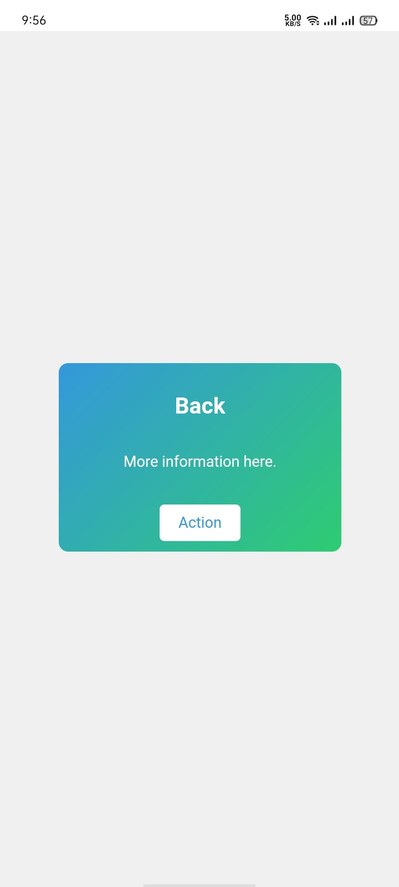

# Card

This project demonstrates the creation of a simple and responsive card component. Cards are commonly used in web design to display content in a clean, organized, and visually appealing format.

## Installation

1. **Clone the repository:**
```bash
  git clone https://github.com/alecodify/html-css-javascript-projects.git
```

## Demo
[Watch the demo video](https://github.com/user-attachments/assets/ba200c58-84fa-4040-a25a-041a631b2cf1)

## Screenshots

<div style="display: flex; flex-direction: 'row';">



</div>

## Contributing
Contributions are welcome! Please feel free to submit a Pull Request.