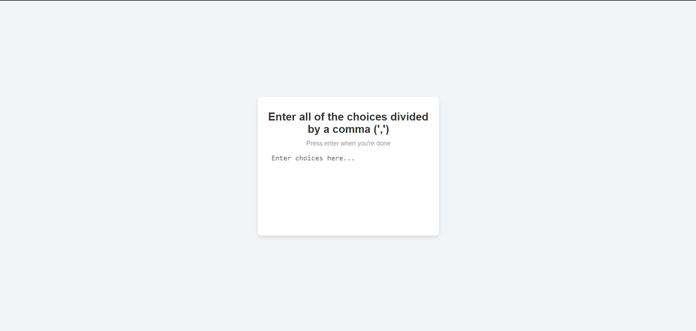
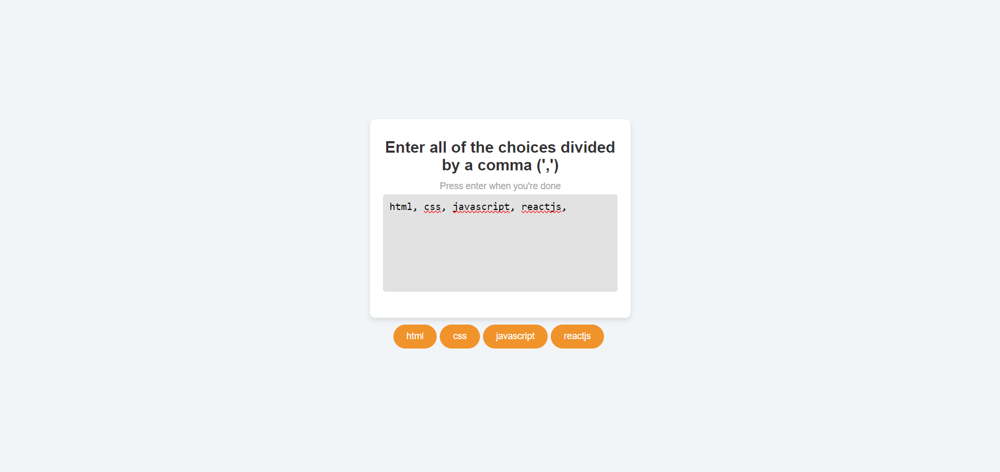
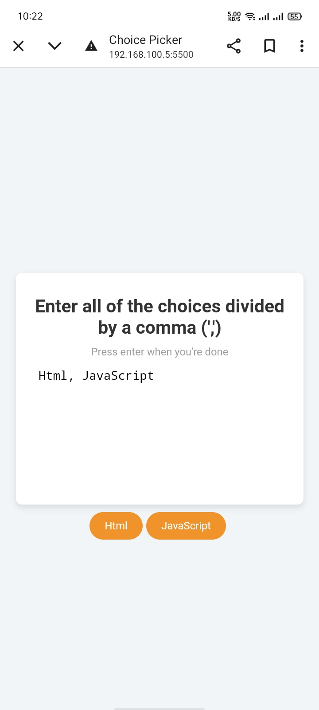

# Choice Picker

This project allows users to add the multiple choices and separate them with comma. The output show below the container. 

## Installation

1. **Clone the repository:**
```bash
  git clone https://github.com/alecodify/html-css-javascript-projects.git
```

## Demo
[Watch the demo video](https://github.com/user-attachments/assets/84f04d71-cf72-4065-b41d-b8bfb8dd8cd5)

## Screenshots


<div style="display: flex; flex-direction: 'row';">


</div>

## Contributing
Contributions are welcome! Please feel free to submit a Pull Request.