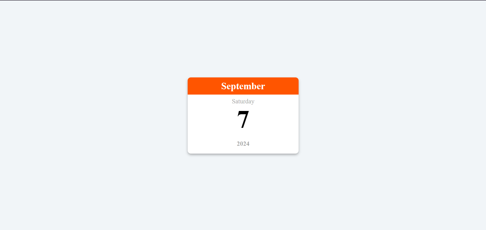

# Mini Calendar

This project displays the current month name with current day, date and year. This project is designed to be responsive and user-friendly, making it easy to integrate into websites or other applications.

## Installation

1. **Clone the repository:**
```bash
  git clone https://github.com/alecodify/html-css-javascript-projects.git
```

## Screenshots


## Contributing
Contributions are welcome! Please feel free to submit a Pull Request.