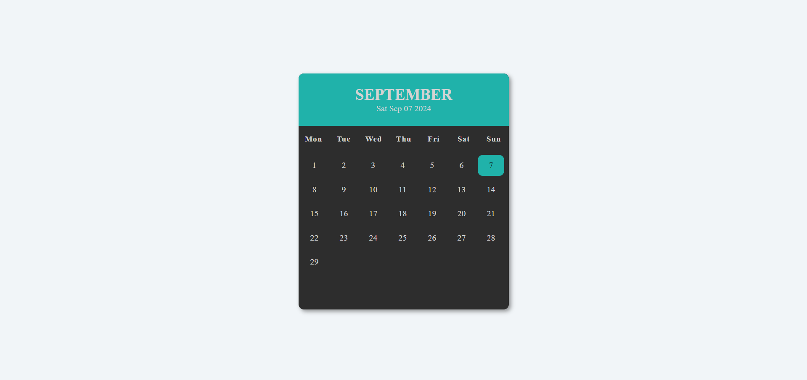

# Month Calendar

This project is a simple, interactive calendar that displays the days of a current month. It allows users to view a date, day in a traditional calendar layout.

## Installation

1. **Clone the repository:**
```bash
  git clone https://github.com/alecodify/html-css-javascript-projects.git
```

## Screenshots


## Contributing
Contributions are welcome! Please feel free to submit a Pull Request.